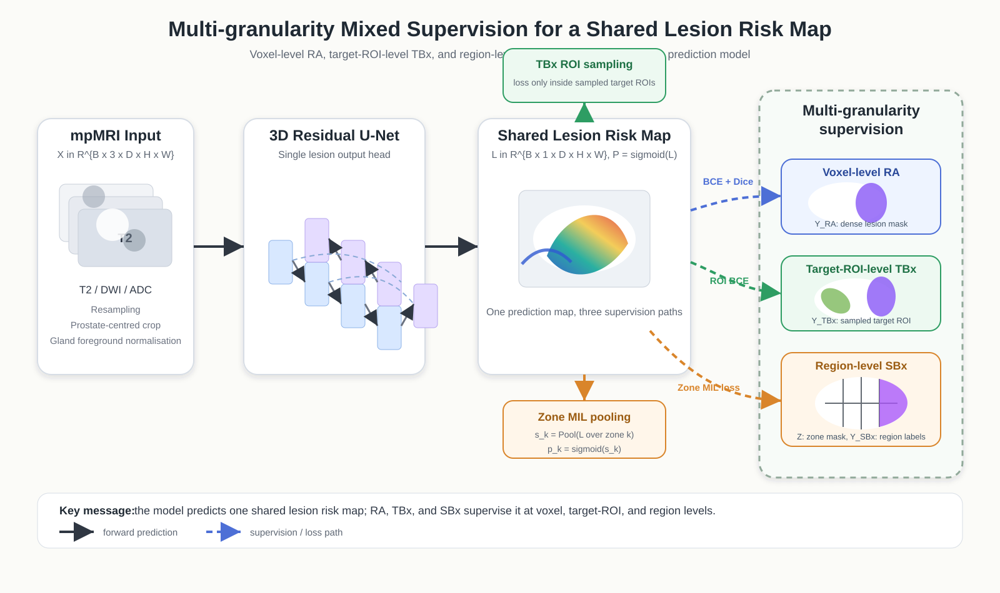

# Mixed-Supervision Prostate MRI

Research code for training and evaluating prostate MRI models with mixed
supervision from radiologist annotations (RA), targeted-biopsy regions (TBx),
systematic-biopsy regions (SBx), and patient-level labels.



## Status

This is a clean public-release candidate assembled from a private research
workspace. It contains source code, tests, and two reviewed schematic assets.
It intentionally excludes patient-level artifacts, datasets, checkpoints,
experiment outputs, private paths, papers, and third-party source trees.

The software is research-only and is not a medical device. Do not use it for
clinical decisions.

## Repository layout

```text
.
├── config.py                  # Experiment and path configuration
├── dataset.py                 # Dataset loading
├── model.py                   # Model definition
├── Loss_function.py           # Mixed-supervision objectives
├── train.py                   # Training entry point
├── test.py                    # Evaluation entry point
├── scripts/                   # Reproducible B/N experiment runners
├── preprocessing/             # First-party dataset preparation tools
├── tests/                     # Unit and specification tests
├── configs/                   # Public configuration examples
└── docs/assets/               # Reviewed schematic figures only
```

## Installation

Python 3.10 or newer is recommended.

```bash
python -m venv .venv
source .venv/bin/activate
python -m pip install --upgrade pip
python -m pip install -r requirements.txt
```

The single requirements file contains the complete training, preprocessing,
official PI-CAI evaluation, and test stack. This includes the comparatively
large optional VTK dependency used by `preprocessing/TCIA_stl2mask.py`.

## Data and paths

No medical data are distributed in this repository. Obtain each dataset from
its official provider and comply with its license, citation, and data-use
terms.

Dataset preparation now has one path-independent entry point. Start with a
preflight-only command and keep the generated workspace outside this Git
repository and outside the downloaded source directories:

```bash
python preprocessing/run_pipeline.py \
  --workspace /absolute/path/to/rp-workspace \
  --datasets pub \
  --pub-root /absolute/path/to/PUB_ROOT \
  --split-mode none \
  --dry-run
```

The adapters support the project's PUB/RA, PROMIS, and TCIA schemas; they do
not accept arbitrary MRI downloads without schema conversion. In particular,
PROMIS currently requires a separately generated 20-zone mask that is not
redistributed here. Exact raw layouts, the enforced order of steps, all-source
commands, split modes, and known limitations are documented in
[`preprocessing/README.md`](preprocessing/README.md).

After a unified workspace has been built, set the training paths with
environment variables or command-line options:

```bash
export RP_PROJECT_ROOT=/path/to/mixed-supervision-prostate-mri
export RP_DATASET_ROOT=/absolute/path/to/rp-workspace
export RP_EXP_DIR=/path/to/experiment-outputs
```

See `configs/environment.example` for the public configuration template.

## Quick checks

Resolve an experiment without starting training:

```bash
python scripts/run_b_experiments.py --experiment b1 --dry-run
python scripts/run_n_experiments.py --experiment n4 --dry-run
```

Run the test suite:

```bash
python -m pytest -q
```

See `scripts/README.md` for training, ablation, and frozen-evaluation commands.

## Reproducibility scope

The first public candidate contains the canonical B0--B4 and N1--N5 experiment
runners, TBx Dice and N4 method ablations, and the generic frozen-evaluation
workflow. Historical, versioned, server-specific, and selected-case scripts are
documented as exclusions in `MANIFEST.md`.

## License and citation

A software license has not yet been selected. Confirm code ownership with all
relevant authors or institutions and add a `LICENSE` file before making the
GitHub repository public. A `CITATION.cff` should be added when the preferred
paper/preprint citation is final. Also confirm that both files in `docs/assets/`
are first-party works or otherwise licensed for redistribution.
